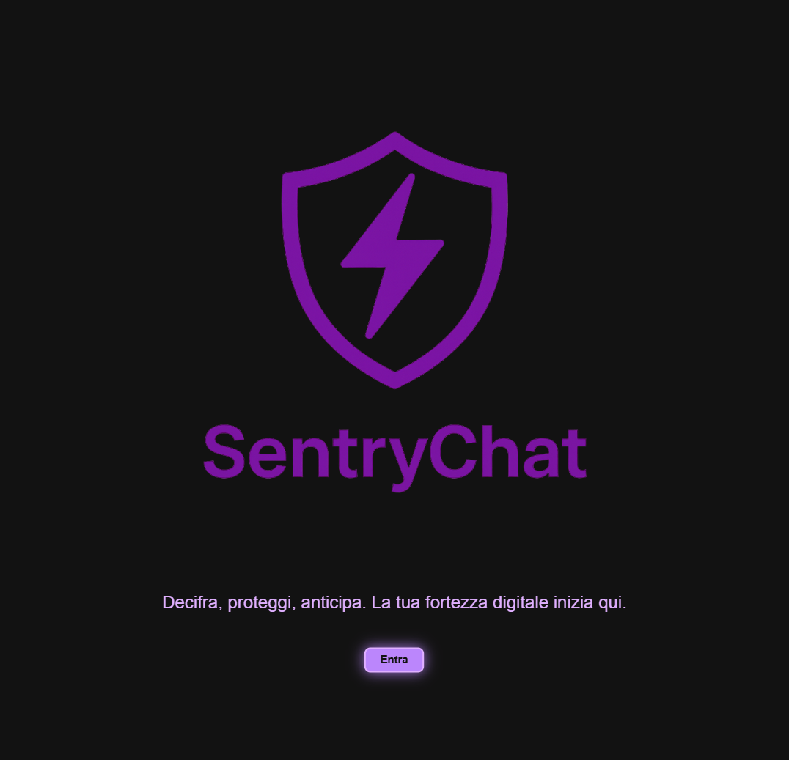
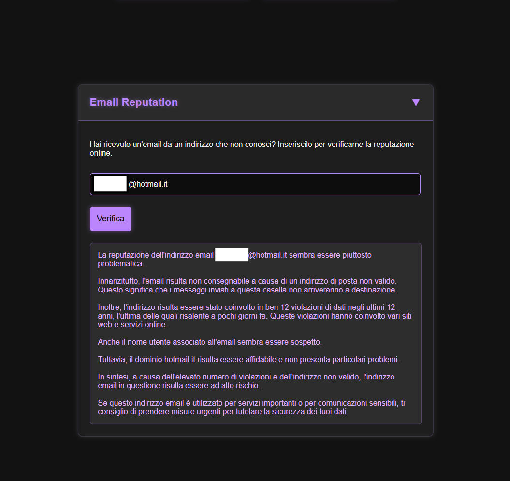

<p align="center">
  
</p>

**SentryChat** è un prototipo di chatbot per la cybersicurezza sviluppato in Python con Flask, con interfaccia grafica moderna e dark style. Offre una serie di strumenti automatici per l’analisi delle minacce digitali ed è pensato per un utilizzo didattico o dimostrativo.

## 🔍 Funzionalità principali

- **Chatbot AI su Cybersecurity**
  - Risponde a domande su phishing, malware, password sicure, buone pratiche e minacce digitali.
- **Analisi email (spam e reputazione)**
  - Valuta contenuto e soggetto per identificare potenziali spam.
  - Verifica la reputazione tecnica di un indirizzo email.
- **Controllo contenuto sospetto**
  - Analizza il testo di una mail per classificare phishing e giudicare eventuali link.
- **Validazione numeri di telefono**
  - Verifica numero, nazione, operatore, tipo (mobile/fisso) e formato.
- **Analisi password**
  - Classifica la forza di una password e suggerisce alternative sicure.
- **Analisi minacce**
  - Fornisce descrizione e pericolosità di un nome malware o minaccia segnalata.

## 📸 Screenshots

<p align="center">
  
</p>

<p align="center">
  
</p>

<p align="center">
  

</p>


## 🧱 Stack Tecnologico

- **Backend**: Python, Flask
- **Frontend**: HTML5, CSS3, JavaScript (stile Matrix UI)
- **AI/LLM**: Groq + Meta LLaMA 4 Scout (via OpenAI SDK)
- **API esterne**:
  - Abstract API (spam, email reputation, phone validation)
  - IntelX (dark web search)

## 🚀 Come avviare il progetto

1. **Clona il repository**
   ```bash
   git clone https://github.com/tuo-utente/sentrychat.git
   cd sentrychat
   ```

2. **Crea un ambiente virtuale**
   ```bash
   python -m venv venv
   source venv/bin/activate  # o .\venv\Scripts\activate su Windows
   ```

3. **Installa le dipendenze**
   ```bash
   pip install -r requirements.txt
   ```

4. **Crea un file `.env` nella root con le seguenti variabili**
   ```env
   GROQ_API_KEY=your_groq_key
   ABSTRACT_API_KEY=your_abstract_key
   ABSTRACT_API_KEY_PHONE=your_abstract_phone_key
   INTELX_API_KEY=your_intelx_key
   ```

5. **Avvia il server**
   ```bash
   python app.py
   ```

## 🎯 Obiettivi del progetto

Il progetto è stato sviluppato come esercitazione finale a partire da una **commessa reale simulata** con i seguenti requisiti:

- Progetto breve ma funzionale
- Interfaccia semplice e intuitiva
- Utilizzabile in locale o deployabile online (testato su Render)
- Chat AI che suggerisce come comportarsi
- Verifica tecnica di elementi sospetti


## 📃 Licenza

Questo progetto è a scopo dimostrativo e non è destinato a un uso in produzione reale.